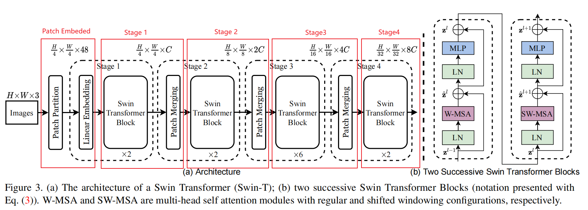

## Swin-Transformer

[论文地址：https://arxiv.org/pdf/2103.14030.pdf](https://arxiv.org/pdf/2103.14030.pdf)       
[源码地址：https://github.com/microsoft/Swin-Transformer](https://github.com/microsoft/Swin-Transformer)        

一个Swin-Transformer的中文注释版本，供大家参考学习！      
A Chinese annotated version of Swin-Transformer!
## CSDN源码讲解导航
- [【Swin Transformer原理和源码解析】Hierarchical Vision Transformer using Shifted Windows](https://hukai.blog.csdn.net/article/details/128133666)   

## 模型结构
图片: 

## 代码使用简介
1. 下载好数据集，代码中默认使用的是花分类数据集，下载地址: [https://storage.googleapis.com/download.tensorflow.org/example_images/flower_photos.tgz](https://storage.googleapis.com/download.tensorflow.org/example_images/flower_photos.tgz),
如果下载不了的话可以通过百度云链接下载: https://pan.baidu.com/s/1QLCTA4sXnQAw_yvxPj9szg 提取码:58p0
2. 在`train.py`脚本中将`--data-path`设置成解压后的`flower_photos`文件夹绝对路径
3. 下载预训练权重，在`model.py`文件中每个模型都有提供预训练权重的下载地址，根据自己使用的模型下载对应预训练权重
4. 在`train.py`脚本中将`--weights`参数设成下载好的预训练权重路径
5. 设置好数据集的路径`--data-path`以及预训练权重的路径`--weights`就能使用`train.py`脚本开始训练了(训练过程中会自动生成`class_indices.json`文件)
6. 在`predict.py`脚本中导入和训练脚本中同样的模型，并将`model_weight_path`设置成训练好的模型权重路径(默认保存在weights文件夹下)
7. 在`predict.py`脚本中将`img_path`设置成你自己需要预测的图片绝对路径
8. 设置好权重路径`model_weight_path`和预测的图片路径`img_path`就能使用`predict.py`脚本进行预测了
9. 如果要使用自己的数据集，请按照花分类数据集的文件结构进行摆放(即一个类别对应一个文件夹)，并且将训练以及预测脚本中的`num_classes`设置成你自己数据的类别数

## 花分类数据集实验结果
模型     | epochs | 准确率/%
-------- |-------| ----
Swin-tiny  | 10    | 95.8%

